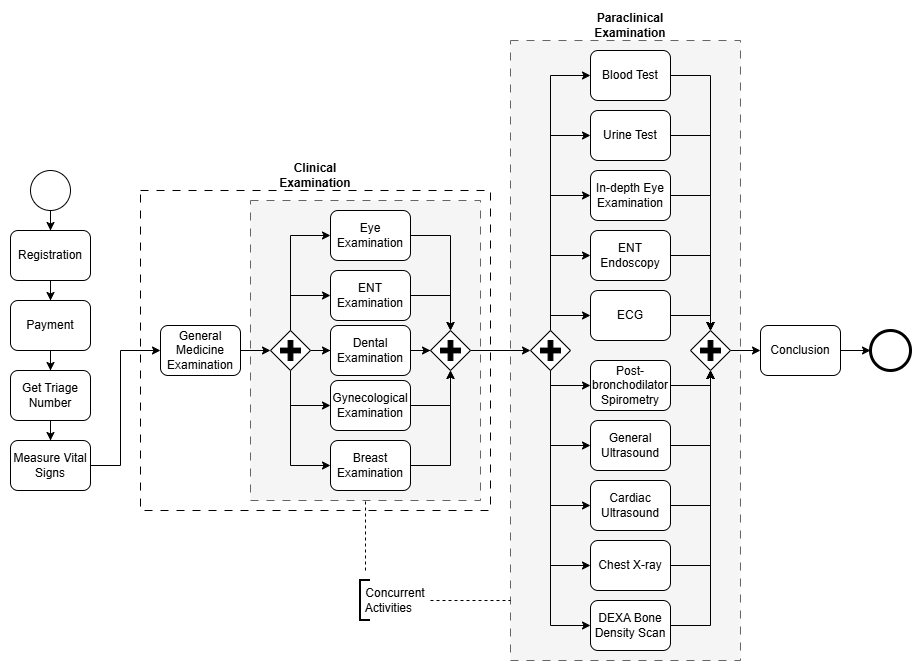

# Constraint-Aware Deep Reinforcement Learning for Next Best Action Orchestration in Business Processes

This repository contains a SimPy-based healthcare process simulation and multiple Deep Reinforcement Learning (DRL) agents (based on the Deep Q-Network family) designed for process orchestration and next-best-action (NBA) routing.

The code serves as the empirical evaluation environment for a proposed three-layer RL-based orchestration framework designed for governance-aware and constraint-compliant deployment in Business Process Management (BPM).

## 📖 Overview

Existing reinforcement learning approaches for process optimization often assume fully autonomous decision-making and struggle with real-world constraints. This project shifts the paradigm from autonomous decision-making toward orchestration support. The RL agent optimizes the execution order and routing of process instances while preserving human control over business-critical decisions.

### Key Methodological Features

- **Invalid Action Masking (IAM)**: Enforces state-dependent action feasibility directly at the output layer of the neural network to ensure compliance with strict operational constraints.
- **Iteration Training**: A multi-generation "train-deploy-collect-retrain" strategy designed to mitigate distribution shift and improve convergence stability.
- **Multiple DQN Variants**: The codebase evaluates six distinct DQN architectures: Vanilla DQN, Double DQN, Dueling DQN, Multi-step DQN, Prioritized Experience Replay (PerDQN), and Rainbow DQN.
- **Literature Baselines**: For comparative evaluation, the repository also implements several published methods: tabular Q-Learning and SARSA from Hundogan et al. (2025), transition-probability-reward Q-Learning and DQN from Soliman et al. (2025), and the prescriptive Next Best Action method from Weinzierl et al. (2020).

## 🏥 The Simulation Environment

The framework is validated through a discrete-event simulation of a general health check-up process.

- **Process Structure**: The simulation models 21 clinical and paraclinical activities (e.g., General Medicine, Blood Tests, X-rays).
- **Dynamics**: Patients are routed through the service network with stochastic arrival rates and service times, creating dynamic congestion patterns.
  

## 🚦Queuing Environments

The repository evaluates the agents across seven distinct queuing scenarios to test robustness under varying capacity constraints:

1. Unlimited Queue (main_1): No capacity constraints; serves as the baseline environment.
2. Static Queue (main_2): Each activity has a fixed maximum queue capacity.
3. Priority Queue (main_3): Emergency patients (20% of the population) receive prioritized access to specific activities, preempting normal queues.
4. Naive Dynamic Queue (main_4): When queues are full, the capacity of the activity with the shortest expected waiting time is temporarily expanded.
5. Linear Dynamic Queue (main_5): Capacity scales linearly based on cluster progression.
6. Gaussian Dynamic Queue (main_6): Queue capacity is sampled from a normal distribution, introducing stochastic capacity variations.
7. Random Dynamic Queue (main_7): Capacity is sampled uniformly from a discrete set at each decision epoch for maximum unpredictability.

## ⚙️ Requirements & Installation

- Python 3.8+
- GPU is used automatically if PyTorch detects CUDA.
  Install the required dependencies:

```bash
pip install -r requirements.txt
```

## 🚀 Quick Start (How to Run)

The code is organized around seven runnable entry points corresponding to the queuing environments listed above. All main scripts follow the same CLI pattern:

```bash
python <main_script.py> <ALGO_NAME> [NUM_PATIENTS]
```

- **ALGO_NAME**: The specific RL variant or baseline method to run (see supported lists below).
- **NUM_PATIENTS**: Optional parameter for patient volume (default is 200).

### Example Commands

```bash
# Run Rainbow DQN in an unlimited queue with 200 patients
python main_1_unlimited_queue.py Rainbow 200

# Run Static Queue DQN with 200 patients
python main_2_static_queue.py StaticQueueDQN 200

# Run MultiStep DQN in a highly stochastic random dynamic queue with 500 patients
python main_7_random_dynamic_queue.py RandomDynamicQueueMultiStepDQN 500
```

## 📊 Supported Algorithms & Baselines

Each environment script supports specific RL variants and baselines. Note that data files referenced by training configs are defined in `common/utils.py`. If a referenced queue log does not exist, the script will generate it automatically.
**Main 1: Unlimited Queue (main_1_unlimited_queue.py)**

- RL Agents: DQN, DDQN, Dueling, PerDQN, MultiStepDQN, Rainbow
- Rule-based Baselines: FORLAPS, LearningToAct, FCFS, Greedy
- Literature Baselines: HundoganQL, HundoganSARSA, SolimanQL, SolimanDQN, NextBestAction
  **Main 2-7: Constrainted & Dynamic Queues**
  (Scripts: main_2_static_queue.py through main_7_random_dynamic_queue.py)
- RL Agents: Prefixed with the environment name (e.g., PriorityQueueRainbow, LinearDynamicQueueDDQN).
- Baselines: Prefixed with the environment name (e.g., GaussDynamicQueueFCFS, DynamicQueueGreedy, StaticQueueFORLAPS).

To see the list of algorithms supported by a specific `main_` script, you can intentionally provide an invalid algorithm name. The script will then print all supported options.

Example:

```bash
python .\main_1_unlimited_queue.py hehe
```

Output:

```bash
❌ Incorrect algorithm: hehe
Supported algorithms: ['DQN', 'DDQN', 'PerDQN', 'Dueling', 'Rainbow', 'MultiStepDQN', 'FORLAPS', 'LearningToAct', 'FCFS', 'Greedy', 'HundoganQL', 'HundoganSARSA', 'SolimanQL', 'SolimanDQN', 'NextBestAction']
```

## 📁 Output Artifacts

Depending on the script and algorithm executed, the simulation will produce the following artifacts in your repository:

- Checkpoints: `logs/<ALGO_NAME>/checkpoint_<N>_gen_<GEN>_<EP>.pth`
- Best Models: `logs/<ALGO_NAME>/final_<N>_gen_<GEN>.pth`
- Training Notes: `logs/<ALGO_NAME>/training_notes_<N>.txt`
- Visualizations: Training plots (reward/loss curves) stored under the `logs/<ALGO_NAME>/ `directory.
- Simulation Data:
  - Queue logs generated under data/raw/ (filenames vary by environment/generation).
  - Event logs produced under data/evaluate/.

## ⚠️ Invalid Action Penalty (Experimental)

All experiments reported in the paper use **Invalid Action Masking (IAM)** to enforce feasibility constraints directly in the action space. IAM guarantees that the RL agent only selects actions that satisfy medical and procedural constraints at each decision step.

For completeness and reproducibility, the repository also supports the **Invalid Action Penalty (IAP)** mechanism. In this setting, the agent is allowed to select any action from the full action space (21 activities). If an action violates process constraints, the environment applies a large negative reward and the action is ignored.

This option is provided primarily for **testing**, as penalty-based handling of invalid actions is known to significantly degrade learning stability in highly constrained environments.

To run the penalty-based DQN experiment:

```bash
python penalty_dqn.py [NUM_PATIENTS]
```
